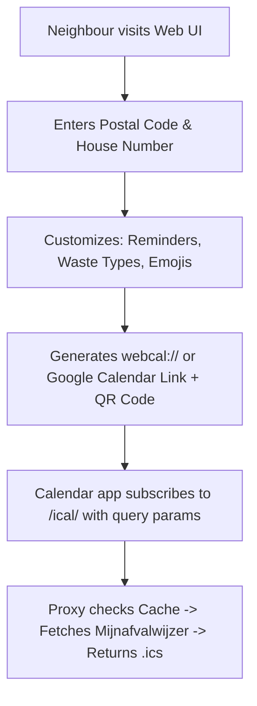

# Neighbourhood Afvalwijzer Calendar Service

## 1. Feature Ideas

### Non-Technical Friendly Web UI
- **Simple Address Form**: A lightweight landing page (HTML/Tailwind/HTMX or Jinja2) where neighbours enter their postal code and house number.
- **1-Click Calendar Subscription**:
  - `webcal://` link (opens Apple Calendar / Outlook directly).
  - Direct "Add to Google Calendar" URL link.
  - Download `.ics` button.
- **QR Code Generator**: Display a QR code on screen so neighbours can scan it with their phone camera to instantly subscribe on iOS/Android.

### Customization & Calendar Personalization
- **Waste Type Filtering**: Let neighbours select which types to include (e.g. check boxes for GFT, PMD, Paper, Restafval). Many neighbours don't need reminders for underground bin waste.
- **Custom Reminders / Alarms**:
  - Configurable notification offsets (e.g. *Evening before at 20:00*, *Morning of pickup at 07:00*, or *No alarm*).
- **Visual Polish (Emojis & Event Formatting)**:
  - Add visual cues to summaries: 🍌 GFT, 📦 Papier, 🧴 PMD, 🗑️ Restafval, 🎄 Kerstbomen.
  - Option for all-day events vs. timed pickup slot events.

### Reliability & Performance
- **Response Caching**: Calendar apps (Apple/Google Calendar) poll subscribed feeds automatically (often every few hours). Caching Mijnafvalwijzer responses (e.g. in-memory TTLCache / Redis for 12–24h) prevents IP rate-limiting from Mijnafvalwijzer.
- **Input Sanitization & Validation**: Normalize Dutch postal codes (`1234 AB` vs `1234ab`).
- **Year-Transition Handling**: Handle month wrap-around when scraping in December for January dates.

---

## 2. Implementation Plan

### Phase 1: Customization Parameters & Caching (Backend)
1. **Extend Query Parameters in `mijnafvalwijzer_ical_proxy/__init__.py`**:
   - `types`: Comma-separated list or multiple query params (e.g. `types=gft,papier`).
   - `alarm`: Notification preset (e.g. `alarm=evening_before`, `alarm=morning`, `alarm=none`).
   - `emojis`: Boolean flag to prefix waste names with emojis.
2. **Update iCal Generator in `mijnafvalwijzer_ical_proxy/formats.py`**:
   - Filter `moments` based on requested `types`.
   - Configure `Alarm` offset dynamically.
3. **Add Caching**:
   - Wrap `fetch_pickup_moments` in `mijnafvalwijzer_ical_proxy/mijnafvalwijzer_client.py` with `cachetools` or `async-cache` keyed by `(postal_code, number, suffix)`.

### Phase 2: Web Interface (Frontend)
1. **Serve HTML / Static Files**:
   - Add a Jinja2 template or static HTML page served at `GET /` in FastAPI.
2. **Interactive Link Builder**:
   - A small JavaScript script that updates the generated `webcal://...` and `https://...` URLs dynamically as options are checked.
3. **Add QR Code rendering**:
   - Use a client-side library like `qrcodejs` to generate the QR code locally in the browser.

### Phase 3: Deployment & Sharing
1. **Reverse Proxy & HTTPS**:
   - Calendar subscription services (especially Google Calendar) require public HTTPS endpoints. Configure Caddy, Nginx, or Traefik with Let's Encrypt in `docker-compose.yml`.
2. **Neighbourhood Distribution**:
   - Share the link on local neighbourhood platforms (e.g. Nextdoor, WhatsApp neighbourhood group, or a physical flyer with the QR code at the waste container area).
